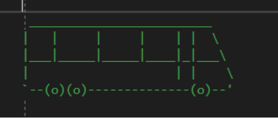

## Задача 1. 
Едно цяло число `n` е по-слабо от цялото число `k`, ако множеството от цифрите на `n` е подмножество на множеството от цифрите на `k`. Две числа са с едаква сила, ако множествата от цифрите им съвпадат. 
Напишете програма, която въвежда две цели числа от клавиатурата и сравнява тяхната сила. Ако множествата от цифрите и на двете числа съдържат различни стойности, да се изведе на екрана подходящо съобщение, че двете числа са несравними. 

**За задачата не се позволява използването на масиви.** 

Примери: 
| Вход | Изход |
| --- | --- |
|123  3121 | Equal strength | 
|12 1523 | First is weaker |
|-43550 340 | Second is weaker |
|123 456 | Not comparable | 
 
## Задача 2. 
Проблем в масив от цели числа `arr` се нарича всяка наредена двойка 
`<i,j>` (i > j), за която е изпълнено поне едно от следните две условия: 
- `arr[i]` е просто и `arr[j]` не е просто. 
- `arr[i]` и `arr[j]` са прости и `arr[i] > arr[j]`  
 
Максималният размер на масива е `1024` елемента.

Да се напише програма, която въвежда дейтсвителната дължината на масива - `length`,  след това `length` цели положителни числа по-големи от `1` и връща броя на проблемите в масива. 

**Валидността на входа за length НЕ е гарантирана.**

Примери: 
| Вход | Изход |
| --- | --- |
| 5 2 3 4 5 | 4     Обяснение на примера:   <5,2>, <5,4>, < 3, 4>, <5,3> | 
| 4 3 5 19 2  | 3 |
| 4 8 5 3 10  | 3 |

## Задача 3. 
Поставени са проследяващи устройства в два автомобила. Всяко устройство изпраща координатите на автомобила - точки в координатната система. 

Напишете програма, която приема цяло `size1` и `2*size1` цели положителни числа - координатите от проследяващото устройство на първия автомобил, след това цяло число `size2` и `2*size2` цели положителни числа - координатите от последяващото устройство на втория автомобил. 

Програмата да отпечатва на екрана дали двете коли са изминали едно и също разстояние разстояние с точност до два знака след десетичната точка. Ако разстоянието съвпада да се отпечата на екрана. 

**Максималният брой интервали, за които проследяващите устройства могат да изпратят информация е 1024.** 

**Валидацията на входа не е гарантирана**

Примери: 
| Вход | Изход |
| --- | --- |
| 3 1 2   4 5   9 3    2 1 1   3 4 | false | 
| 2 1 3   1 9     3   3 1  5 1   9 4 | true 6.00 | 
 
## Задача 4.
Да се въведе естествено число `n`. Числото `k` се нарича подчисло на `n` ако е образувано чрез премахването на `0` или няколко цифри на `n`. Да се отпечата сумата на всички подчисла `k` на `n`, които се състоят само от различни цифри. 

**За решаването на тази задача не са позволени масиви.** 
Вход | Изход | Обяснение
--|--|--
123 | 177 | 1 + 2 + 3 + 12 + 23 + 13 + 123 
11211 | 72 | 1 + 1 + 2 + 1 + 1 + 12 + 21 

## Задача 5
**а)** Да се напише функция, която изчертава следното превозно средство на екрана. За изчертаването може да използвате манипулатори, символи, цикли, условни опаретори и едномерни масиви, но не можете да използвате двумерни или многемерни масиви.

**б)** Да се симулира движение на превозното средство по екрана - от ляво надясно. За анимирането могат да се използват следните допълнителни команди:
- system(“CLS”) или system("clear"); #include <stdlib.h> - изчиства съдържанието на конзолата; 
- sleep_for или друга подобна функция за забавяне на преминаването на картинката 
